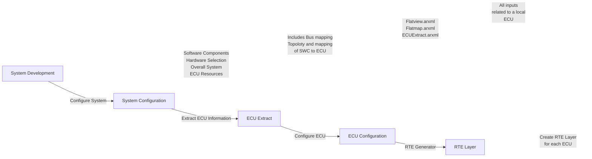

# General AUTOSAR Notes:
- `AUTomotive Open System ARchiteture`.
- Created in 2003.
- Based on 3 layers:
  - Application Layer.
  - Runtime Enviroment.
    - Virtual Functional Bus.
      - Abstraccion set of RTE.
      - Handle communication within the ECU and between ECUs.
  - Basic Software:
    - Standarized Sofware Layer.
    - Divided in three levels.
      - `Services`.
      - `ECU Abstraction`.
      - `MCU Abstraccion`.
        - Based on ECU Hardware.
- Metamodel -> UML 2.0.
- Specification only.

## Methodology:
- System Configuration Description:
- ECU Extract:
- ECU Configuration Description:
- Flow:
  - Configure System:
    - Map Software components to ECU based on resource, timming and requirements.
  - Configure ECU:
    - Like Task mapping and scheduling.
    - Bsw Configuration.
    - Core Partition.

## MCAL:
- Software module that has direct access to all the on-chip MCU Periferals.

## AUTOSAR Classic:
- Based on OSEK Os:
  - Real time control system.
  - Safety Critical.
  - Real time requirements.
- Uses Embedded C.

## AUTOSAR Adaptive:
- Based on Posix OS:
  - Common set of APIs for UNIX-like operating systems.
  - Medium to high real time application.
- Uses C++.
- High performance computing Hardware.
- Secure on-board communication.
- Service orientes Architecture.
- Ethernet with SOME/IP.

## Importan Files:
### AUTOSAR Sys-D:
- .ARXML
- System design / Software Architecture.
- Define HW Topology.
- Define SW-Cs, Runnables, Data Mapping of SW-Cs.
- Communication Matrix.
- Exported as AUTOSAR Sys-D.
### AUTOSAR SWC-D:
- .ARXML
- Definition of ECU Application (SWC).
- Model Application Behaviour.
- Define ports and Data types.
- Create SW-C Description.
- Export SW-C Description.
- Generate Application Code. 
### AUTOSAR BSW-Config
- .epc / .xdm
- Configuration of ECU Basic Software.

## AUTOSAR DataType:
- SwDataDefProps.
- Application Data Categories -> CompuMethdod -> Implementation Data Type -> Base Type
- Naming convention:
  - 128 characters.
  - Start with letter.
  - Without underscore.
- Recommended to set default.