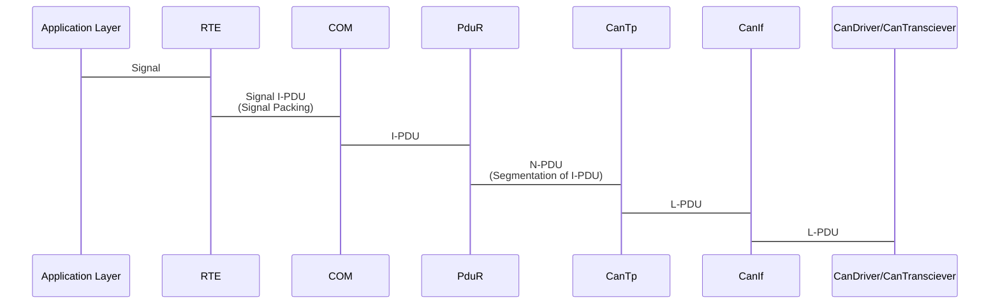

# AUTOSAR Communication Stack Notes:

## AUTOSAR Com:
- Module between RTE and PDU Router.
- OSEK COM -> Provides uniform communication to the CAN network.
- Provide signal level access to the application layer.
- Provide PDU level acces to lower layers.
- Protocol Independent.
- Packs the signal to a PDU at Tx.
- Unpacks Rx PDU to provide signal access.

## AUTOSAR PDU Router:
- Route PDU to respective Bus Specific Interface.
- PDU Level Gateway:
  - Route Rx PDU from a bus to a different bus.
  - Can route from different controllers of the same bus.

## CAN Stack:
### Sequence Diagram:

### CanNM:
- Hardware Independent.
- Coordinate between different mode of CAN network (bus sleep/normal mode).
- Provide adaptation layer between Network Managment Interface and CAN Interface (CanIf).
- CanNM Modes:
  - Network Mode.
  - Prepare Bus Sleep.
  - Bus Sleep Mode.

### CanSM:
- State Manager for respective bus/network.
- ComM uses CanSM to request mode changes of Can Network.
- Is responsible for controlling the flow abstraction of CAN network in AUTOSAR.

### CanTp:
- Solve the problem of CAN messages Tx/Rx being larger than the maximim supported size.
- Message segmentation so it can be send as independent frames.
- Provide services to re-assemble the recieved PDUs.
- Error detection in segmentation.
- PduR determine if the CanTp is used.

### CanIf:
- Interface to the services of CAN Driver for the upper Communication Layer.
- Manage different HW devices like CAN controllers and CAN Transciever.
- Consist on all the HW Independent Tasks which belongs to the CAN Communication devices drivers.
- Responabilities:
  - Transmit Request Processing.
  - Transmit Confirmation.
  - Recieve Indication.
  - Error Notification.
  - Start/Stop of CAN controllers.
  - Waking up/Participating on a network.

### Can Transciever Driver:
- Provide drivers for on-board CAN Transciever.
- Communication over SPI.

### Driver for External CAN ASIC:
- CAN aPPLICACION Specific Integrated Circuit.
