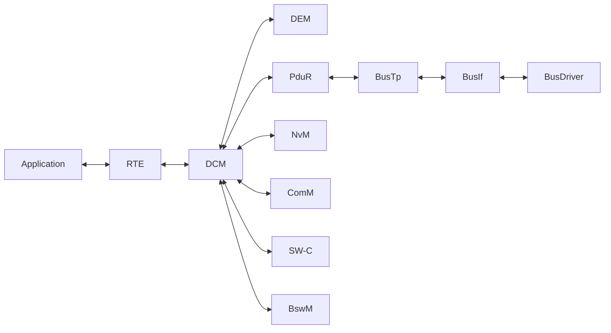
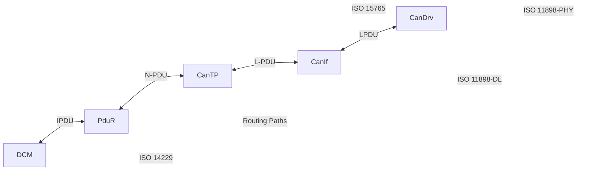
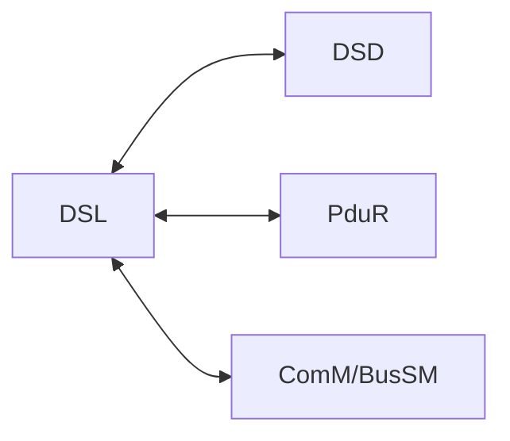

# AUTOSAR Diagnostic Stack Notes:
- Identification of SW and HW Version.
- Fault Managment.
- Coding Adaptation and Calibration.
- Programming.
- Function Check.
- Authorities demand.
- OBD.
  - On Boad Diagnostics:
    - Capability of the car to diagnose it own health and record any faults occurred in its memory.
- UDS.

## Modules:
### DEM (Diagnostic Event Manager):
- Processing diagnostic events.
- Storing events and event data to NVM.
  - Event Memories:
    - Primary Memory.
    - Secondary Memory.
    - Mirror Memory.
- Errors in Production/actual products:
  - Operation cycles.
  - Freeze Frames:
    - Extended (added) new record if error re-occurs.
  - Extended Data Records:
    - Configurable fault data.
    - Updated if error re-occurs.
- Provide information to DCM.
- Define DTCs.
- Helpful:
  - Provide `Dem_PreInit` function to avoid chicken-egg issue with NVM.
### DCM (Diagnostic Communication Manager):
- Network independent.
- Hides timming handling, session and security managment from the user.
- Process complete diagnostic buffer handling.
- Communication with external tools.
- DTC or DID.
- Recieve request -> Validate service -> Take ACTION -> Reply.
- ISO 14229.
- Can trigger Diagnostic Request by itself.
- Handle communication with Diagnostic tools like OBD or UDS.
#### Path:

#### DCM SWS Docuemnts:
- Chapter 7 -> Requirements.
- Chapter 8 -> API.
- Chapter 9 -> Sequence Diagram.
- Chapter 10 -> Configuration Specs.
### FIM (Function Inhibition Manager):
- Calculates and summarizes permission/inhibition conditions.
- Inhibition of particular functionalities of software components based on evenet status.
- Uses FID (Function Identifier).
- FID is assigned to SW-C.
- Based on event estatus, FID's status is derived and whcih will decide whether to execute the functionality or not.
- 2 Mechanism:
  - Polling -> Not really useful / Default.
  - Trigger -> Better option / Most used.
### DET (Development Error Trace):
- Only for development.
- Provide APIs to report an error.
- Each error has a number.
- Each module define their information about DET.
- Should be disable in production.
- Helpful:
  - Set breakpoint in `Det_ReportError` function.

## Diagnostic Stack Data Diagram:

### OSI Model
- DCM:
  - Session/Application.
- PduR:
  - Network.
- CanTP:
  - Transport.
- CanIf:
  - Datalink.
- CanDriver:
  - Physical.

## Diagnostic Time Parameters:
- DSL shall star/maintiain or end session.
- DSL Takes care of handling timming paramteres.
- DSL will enforce and ensure those timming and their fuctionality.
### P2 Server Max:
- Time between service request abd service response.
- The maximum limit if P2 Server is P2 Server Max.
#### NRC 78:
- DSL Handle timming and session but the responses are handled by DSD and DSP or any other module.
- If P2 Server Max is expired, DLS need to send some response.
- In that case DSL trigger a NRC 0x78 meaning Request Correctly Received Response Pending (RCP_RP).
- Is done by DSP but handled by DSL.
- Use seconds and floating point value.
### P2* Server Max:
- Is the maximum limit of time allowed since NRC 0x78 is send and the actual response or the next NRC 0x78 response is allowed.
- Is greater than P2 Server Max.
- Is done by DSP but handled by DSL.
- Use seconds and floating point value.
- DSL need a maximun number of NRC 0x78 that can be sent.
  - Max Num Resp Pend.
  - Configurable as `uint8_t`.
### S3 Server Timer:
- Any communication from Tester to ECU makes DSL to maintain the ECU in the same diagnotic session.
- S3 server Time is the time elapsed since last service is processed.
- S3 Server MAC
  - Time limit after which DSL ends the non-default diagnostic session and enter default diagnostic session.
- Is user configurable in DCM.
- The time is measured from response to next request.
#### Tester Present (0x3E):
- If tester wants to maintain not default session, w/o triggering a functionality, the tester present shall be used.
- If SID 0x3E is request, DSL reset the S3 Server timer to zero.
- This service trigger no other functionality.

## DCM Layers:
### DSL (Diagnostic Session Layer):
- Lower Submodule.
- Accept request from PduR and pass it to DSD. Other way as well.
- Handle session related functionalities.
- Manage Diagnostic States.
- Respone Forwarding.
- Check for:
  - Tester present.
  - Security Level of ECU.
  - Keep track of current session.
  - Protocol Timming.
  - Handling between OBD and UDS.
#### Interaction:

#### DSL Resource Manager:
- DCM Buffer:
  - Where UDS Service Request and Response are Updated.
  - Depends on ISO 15765 - Part 1.
  - Memory location where UDS request is received.
- DCM Rx Pdu Id:
  - Functional Addressing.
  - Physical Addressing.
- DCM Tc Pdu Id:
  - Response Physicar ID.
#### DSL Request Handling:
- DCM Rx Pdu Id received by Com Stack.
- Multiframe must be combined and the I-PDU of the service req must be updated in DCM buffer.
- PduR call DCM to update the DCM Buffer everytime the multiframe are received.
- Once completed DSL will trigger DSD Module.
#### Tester Present Service Handling:
- DSL handle Tester Present (Service 0x3E) by itself.
- Tester Present maintains a non-default diagnostic session between the Tester and the ECU.
- S3 Server time holds the time since last Tester Present.
- Exist a timer after which the ECU comes back to default session (Ussually 5 seconds).
#### DSL Response Handling:
- When response is ready in DCM Buffer the DSD will indicate DSL.
- DSL shall indicate that the response is ready to the PduR.
- PDU will request the response piece by piece as flow control.
- After PduR send all the I-PDU it will send the TxConfirmation to DSL.
- DSL will confirm the transmittion to DSD as well.
  
### DSD (Diagnostic Service Dispatcher):
- Dispatchs service from one moudle to another.
  - From DSL to DSP and the other way around.
- Validate requested Service and Send request to DSP.
  - Diagnostic Session.
  - Security Access Level.
  - App permission.
- Check for security and Session access of the incomming request.
- Check for service support.
- Collect response from DSP, and built message to DSL.
- Check for all standard NRC's.
- Keeps trac of the progress of a service request excecution to facilitate dispatch work.
- Two services produce multiple response for a single request:
  - Read Data by Periodic Identifier (0x2A).
  - Response on Event (0x86).
- Services responding huge block of data:
  - Like 0x19(Read DTC Information) and 0x36(Transfer Data).
  - Can demand a lot of memory.
  - DCM buffer is filled and Tx partially.
    - Repeate the Buffer filling and partially Tx until done.
#### Use Cases:
- Rx request Msg and Tx Positive Response.
- Rx request Msg and Supress a Positive Response.
  - Supression of response is based on subfunction SPRMIB.
    - Byte 7 MSB.
- Rx request Msg and Supress a Negative Response.
  - Only done forfunctional addressing.
  - Will only suppress some NRC:
    - 0x11 -> Service not supported.
    - 0x12 -> Subfunction not supported.
    - 0x31 -> Request out of range.
    - 0x7E -> Subfunction not supported in active session.
    - 0x7F -> Service not supported in active session.
- Rx request Msg and Tx Negatice Response.
- Tx positive response w/o Rx request Msg.
- Segmented Responses.

### DSP (Diagnostic Service Processor):
- Perform check and excecutes particular action based on request.
- Check for message format.
- Assemble part of the response.
- Service implementation.
- Has a collection of processes for different services.
- Support both UDS and OBD.
- DID and RID tables are handled in DSP submodules.
- Interact with other AUTOSAR Modules and get the service excecuto done.