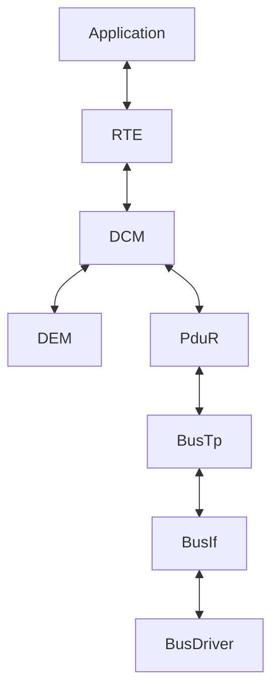

# AUTOSAR Diagnostic Stack Notes:
- Identification of SW and HW Version.
- Fault Managment.
- Coding Adaptation and Calibration.
- Programming.
- Function Check.
- Authorities demand.
- OBD.
- UDS.

## Modules:
### DEM (Diagnostic Event Manager):
- Processing diagnostic events.
- Storing events and event data to NVM.
  - Event Memories:
    - Primary Memory.
    - Secondary Memory.
    - Mirror Memory.
- Errors in Production/actual products:
  - Operation cycles.
  - Freeze Frames:
    - Extended (added) new record if error re-occurs.
  - Extended Data Records:
    - Configurable fault data.
    - Updated if error re-occurs.
- Provide information to DCM.
- Define DTCs.
- Helpful:
  - Provide `Dem_PreInit` function to avoid chicken-egg issue with NVM.
### DCM (Diagnostic Communication Manager):
- Network independent.
- Hides timming handling, session and security managment from the user.
- Process complete diagnostic buffer handling.
- Communication with external tools.
- DTC or DID.
- Recieve request -> Validate service -> Take ACTION -> Reply.
- ISO 14229.
- Can trigger Diagnostic Request by itself.
### Path:

#### DCM Layers:
- DSL (Diagnostic Session Layer):
  - Accept request from PduR and pass it to DSD. Other way as well.
  - Check for:
    - Tester present.
    - Security Level of ECU.
    - Keep track of current session.
    - Protocol Timming.
    - Handling between OBD and UDS.
- DSD (Diagnostic Service Dispatcher):
  - Validate requested Service and Send request to DSP.
  - Check for security and Session access of the incomming request.
  - Check for service support.
  - Collect response from DSP, and built message to DSL.
- DSP (Diagnostic Service Processor):
  - Perform check and excecutes particulat action based on request.
  - Check for message format.
  - Assemble part of the response.
  - Service implementation.
### FIM (Function Inhibition Manager):
- Calculates and summarizes permission/inhibition conditions.
- Inhibition of particular functionalities of software components based on evenet status.
- Uses FID (Function Identifier).
- FID is assigned to SW-C.
- Based on event estatus, FID's status is derived and whcih will decide whether to execute the functionality or not.
- 2 Mechanism:
  - Polling -> Not really useful / Default.
  - Trigger -> Better option / Most used.
### DET (Development Error Trace):
- Only for development.
- Provide APIs to report an error.
- Each error has a number.
- Each module define their information about DET.
- Should be disable in production.
- Helpful:
  - Set breakpoint in `Det_ReportError` function.