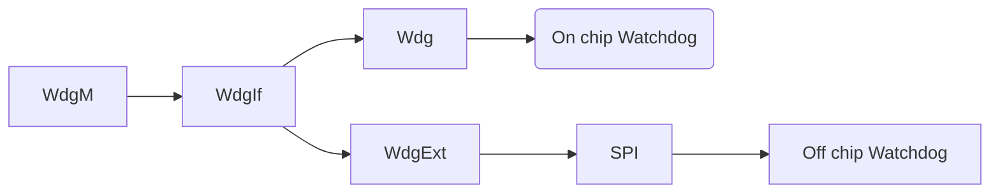

# Mode Management:
- ECU State (Bsw Mode) Manager.
- Watchdog Management.
- Communication Managment.

## StartUp Process:
- EcuM (ECU State Manager):
  - On -> Start up One (Start Os) -> Start Up Two (Init SchM. Init BswM)
    - SchM : Basic Software Scheduler Module.
    - BswM: Basic Software Mode Manager
- BswM:
  - Start up Two A -> Start up Two B -> Run Two.

## Shutdown Process:
- BswM:
  - Prep to Shutdown -> Go off One A -> Go off One B.
- EcuM:
  - Go off Twoo -> Off.

## Sleep Process:
- BswM:
  - Prep Shutdown -> Go Sleep.
- EcuM:
  - Go Sleep -> Sleep (Loop until wake up).

## Wake Up:
- EcuM:
  - Wake up / Re-start -> Wake up validation -> Wake up reaction.
- BswM:
  - Wake up two -> Run Two.

## BswM Rules:
- Rules -> Action True.
- Rules -> Action False.

## Watchdog Stack:

## ComM (Communication Manager):
- Handle communication modes for each channel.
- Handle bus error managment.
- Support Partial Networks.
- Offers an API to siable sending of signals to prevent the ECU from waking the bus.
- 