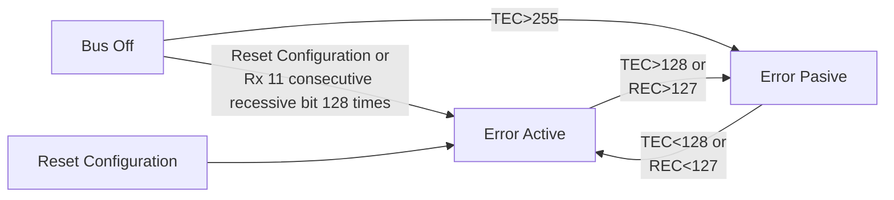
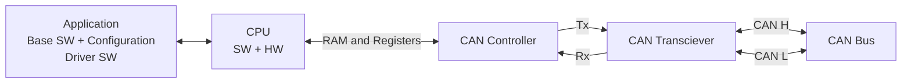

# CAN Interview Notes:
- Control Area Network.
- Serial Bus protocol.
  - Use MSB going first.
- Asynchronous.
- Multicast. type (like Broadcast).
- Multi-master.
- Small frame size:
  - 8 bytes.
  - Speed: 1Mbps at 40 meters.
- Industry ussually use 500 kbps:
  - 1 second means 2000 CAN frames.
- Frame:
  - PCI.
  - Data.
- Base on voltage difference:
  - Logic 1: Recesive.
  - Logic 0: Dominant.

| Level | CAN H | CAN H | delta V |
|-------|-------|-------|---------|
| L0    | 2.5   | 2.5   | 0       |
| L1    | 3.5   | 1.5   | 2       |
- CAN Transciever convert TTL logic to CAN logic.
- Half-duplex communication.
  - For some node is either Tx or Rx.

## CAN Messages:
- Message base protocol.
- Use Message ID:
  - Identify Message.
  - Establish message priority.
  - Used in message filters.
- ACK field is in the same frame.
  - No more bus load.
- CSMA-CA: Carrier Sense Multiple Access - Collision Avoidance.
- Temporary Node Failure:
  - Ongoing frame destroyed.
- Permanent Node Failure:
  - Node no longer connected to be bus.
  - No Tx nor Rx.
### Frame Types:
#### Data Frame:
- Standard Frame:
  - 11 bit message ID.
- Extended Frame:
  - 29 bit message ID.
    - 11 bit base + 18 bit ID extention.
#### Remote Frame:
- Frame to request a Data Frame.
- A node that wants a Data Frama send the remote frame with same Msg ID.
- The node that owns the data frame send it immediatly after the remote frame.
- Obsolete.
#### Error Frame:
- Signal a error condition in the data frame being transmitted.
- If a node detect an error, it destroys the message and signals all nodes by Tx an error frame.
#### Overload Frame:
- Send by a node when it's overloaded and needs some time to process thed ata frame received.
- Format is the same as error frame.
- The idea is buy time by keeping the bus busy with overload frame preventing new data frame bein Tx.
- Max 3 overload frame can be Tx by each node after a data frame.

## Standard Data Frame Format:
- Bus Idle:
  - Recesive State (Logic 1).
- Start of frame:
  - SOF.
  - Dominant bit (Logic 0).
- MSG Id:
  - 11bit (0x000 - 0x7FF).
- RTR (Remote Transmit Request):
  - 1 bit
    - Dominant bit (Logic 0) -> Data Frame.
    - Recesive bit (Logic 1) -> Remote Frame.
- R1/R0 :
  - Recessive (2 bits).
  - Reserved.
    - R1 -> IDE: used to differenciate Standard and Extended.
    - R0 -> FDF: used to differenciate CAN and CAN-FD.
- DLC (Data Length Code):
  - 4 bit (0 to 8).
- Data:
  - 0 to 8 bytes.
- Checksum:
  - 15 bit.
  - BCH method.
- CRC Delimet:
  - CD.
  - 1 bit.
  - Recessive (Logic 1).
- ACK:
  - 1 bit.
  - Tx node put a recessive bit in ACK.
  - All Rx nodes who wants to acknowledge will put a Dominant in ACK.
- ACK Delimet:
  - AD.
  - 1 bit.
  - Recessive (Logic 1).
- EOF (End of Frame):
  - Recessive (Logic 1).
  - 7 bits.
- IFS (Inter Frame Spacing):
  - Recessive (Logic 1).
  - 3 bits.
### Frame sections:
- Arbitration Field:
  - SOF + Msg Id + RTR.
- Control Filed:
  - R0 + R1 + DLC.
- Data Field:
  - Data.
- CRC Field:
  - Checksum + CD.
- Acknowledgement Field:
  - ACK + AD.
- End of Frame Field:
  - EOF + IFS.

## Extended Frame Format:
- 11bit message allow for 512 frames per entwork, in real application it's not enough.
- Extended frame uses 29bit Msg ID, 18 more called IDE.
- Standard frame and Extended frame CAN Frames can co-exist.
- Arbitation Filed:
  - SOF (1bit) + Msg ID (11bit) + SRR (1bit) + R1(IDE)(1bit) + Extended ID (18bits) + RTR.
  - SRR -> Substitute for Remote Request.
### Additional bits:
- SRR:
  - Substitute Remote Request.
  - Always Recessive (Logic 1) and single bit.
- IDE:
  - Identifier Extension Indication bit.
  - Indicate presence of Extended Identifier.
    - Recessive (Logic 1) -> Extended.
    - Dominant (Logic 0) -> Standard.

## CAN Bit Segmentation:
- Bit monitoring -> monitoring the bus for bit value.
  - Tx node puts the bit value on bus.
  - Rx node sample the bus ans reads the bit value.
### CAN bit segment:
- Bit Segments: Point of time in bit value does sampling.
- Sync_Seg.
- Prop_Seg.
- Phase_Seg1.
  - Bit sample point.
- Phase seg2.
### Propagation Delay:
- Propagation segments compensate for propagation delay on the bus.
- Tx of a bit and propagation must be over for all nodes on the bus before the bit sampling has to happen to ensure all the nodes read the same value for a bit on the bus.

## CAN Bus Arbitration:
- Bus arbitration -> resolution to conflict for multiple Tx nodes transmiting simultaneously.
- SOF + Msg ID + RTR are involved.
- The node that win will Tx the complete frame and the other will became Rx nodes.
- Lossing modes will Tx after the bus goes IDLE.
- Only one transmitter is allowed to Tx at the time.
- Other node wait for Bus IDLE.
- Iterate over every bit and a Dominant bit win (Logic 0) so the other became Rx.
- Lowest Msg ID -> Higher priority.

## Bit Stuffing:
- With every edge (bus satet change) the Rx node can adjust the internal clock ticks.
- So having bus state unchanged for long time is risky.
- If CAN bus has a constant value for 5 bit length, then an inverse (complementary) bit is inserted.
- Bit stuffing from begining of SOF until the end of the checksum field.
- Do not apply for fixed format part like CD to IFS.
- It's consider for CRC computation.
- Tx side does `Bit Stuffing`.
- Rx side does `Bit Destuffing`.

## CAN CRC (BCH Method):
- Polynomial for CAN: `1100010110011001`.
- Data Stream + 15bits of 0's (CRC size).
- Use Xor table.
- First 16bit Xor with Polynomial.
- Grab result + more data of the data stream to Xor with the Plynomial, so the MSB of the polynomial is allign with the MSB of the result Xor.
- Repeat until whole stream (Data + 15bit O's) is been Xor with polynomio.
- When last 0 is borrowed that 15bit number is CRC.

## CAN Error Handling:
- All Rx nodes must recieve the information which the Tx application is intended. If some problem happens in this then we call as CAN error.
- The problem happens may happen in Tx node, or CAN bus or Rx node. CAN Protocol has capability to detect any such problems and raise an error flag.
- We can have Tx errors and Rx errors.
- When a node (Tx or Rx) detects a CAN error, it starts sending the error flag on the bus immediatly.
- Error flag is design in a way that it destroys the data frama currently present in the bus.
- Depending of this error flag other nodes also may put its own error flag on CAN bus.
- Depending on the node which raised the error flag, will increment its error counter value to keep track and manage CAN error states.
### Type of CAN Error:
#### Bit Error:
- Transmitter errors.
- These decide the TEC Counter increment.
- Tx node monitors a different bit value than the value it Tx in that bit.
#### CRC Error:
- Reciever Errors.
- These decide the REC Counter increment.
- Rx node has not given acknowledgment but still monitors a dominant bit in the ACK slot.
#### Acknowledgement Error:
- Transmitter errors.
- These decide the TEC Counter increment.
- Tx node monitor a Recessive bit in ACK slot, then it emans it did not get a Ackledgment.
#### Stuff Error:
- Reciever Errors.
- These decide the REC Counter increment.
- Rx node recieves at-least 6 consecutives bit of the same polarity.
- Every same polarity 5bit will get a complimentary bit inserted.
- Bit stuffing is applied from SOF to checksum.
#### Form Error:
- Reciever Errors.
- These decide the REC Counter increment.
- When fixed form of CAN dataframe (CD + AD + EOF) is altered.
### Error Frame Format:
- Signals to other nodes that the current Data Frame is erronous.
- Any of the 5 CAN Errors will result in destruying the current Data Frama by overlap of Error Frame.
#### Error Flag (Active and Passive):
- Node signals the error to remaining nodes by a flag.
- Error flag has to be noticed by all nodes and not be mistaken to be normal frame bits.
- So the formar of the Error flag is close ina wat that such format cannot exist enywhere in a normal data frame.
  - Because it violates the Bit Stuffing Rule.
- Error Flag is 6 consecutives bits of the same polarity:
  - Active Error Flag (6 dominants -> 000000b).
  - Passive Error Flag (6 recessive -> 111111b).
#### Basic Error Frame:
1. 6bit Error Flag Field:
   - Active error flag: All dominant bits (0s).
   - Passive error flag: All recessive bits (1s).
2. 8 recessive bit of Error delimet filed:
   - (1bit + 7bit).
3. 3 recessive bit of Interframe space field.
#### Complete Error Frame:
- Superposition of all error frames forms complete error frame on the bus.
  - Error flag could be form 6 to 12 bits.
- After error flag, 1st bit of delimeter is sent by node. 
  - If it monitors a Dominant bit then it waits until a recessive bit is monitored on the bus and then send remaining 7 delimeter bits.
  - Else if it monitos Recessive bit, it send the remaining 7 delimeter bit directly.
- Passive error flag from Rx node cannot destroy the data from Tx Node.
- Last 7 Recessive bits of errpr Delimeter always in sync between nodes.
### CAN error States:
- Fault Confiment:
  - CAN error detection can pinpoint to "perpetrator".
  - Distiction between temporary and permanent node failures.
  - Identification and removal (self-retirement) of malfunctioning nodes from the bus.
- Error Counters:
  - Bit error and ACK error are Tx erros:
    - Can be deletec only by Tx nodes.
  - CRC error, Form errors & stuff error are Rx errors:
    - Can be detected only by Rx nodes.
    - Two counters for each node:
      - From 0 - 255.
      - Transmit Error Counter (TEC).
      - Receiver Error Counter (REC).

## CAN Error State Machine:

### REC Rules:
- REC increments by 1 when receiving node detects an error.
  - Exception: nit error during Tx of an active error flag or overload flag.
- REC increments by 8 when:
  - Detects a dominant bit after sending an error flag.
  - Detecs a bit error during sending an active error flag or overload flag.
  - Detects 8 consecutive dominan bits after it sent its error flag.
- REC Decrements by 1 inder the following conditions:
  - The frame was received properly w/o any error until ACK Slot.
  - Sucessfully sending of ACK bit.
  - REC is between 1 and 127:
    - If REC is greater than 127 then its value will be set to value between 119 and 127.
### TEC Rules:
- TEC will incremented by 8 when:
  - Tx send an error flag:
    - Exceptions: 
      - The Tx node is in passive error and tectec an ACK error and doesn't detect a dominant bit while sending passive error flag.
      - Tx node an error falg due to stuff error during bus arbitration, where stuff bit is sent Recessive but monitored as dominant.
  - Tx node detects a bit error during sending an active error flag or overload flag.
  - Detects 8 consecutive domiant bits after it sent its error flag.
- TEC decrements by 1 after sucessful trnasmission of a frame unless its value is already 0.

## CAN-FD:
- Based on CAN (Improvement).
- Modern CAN Controllers support both CAN and CAN-FD frames.
- CAN-FD is compatible with CAN.
- CAN-FD can carry up to 64 bytes of data.
- CAN-FD frame maximum speed up to 5Mbps (CAN only 1Mbps).
### CAN-FD Frame Format:
- SOF (1bit):
  - Single dominant bit (0).
- Identifier (11bit):
  - Same addressing for Standard and Extended Format (11bits).
- RRS (1bit):
  - Always dominant but (0).
  - Removes RTR bit.
- IDE (1bit):
  - Same for CAN and CAN-FD.
- FDF (1bit):
  - FD Frame.
  - New on CAN-FD.
  - Recessive (0).
- Reserved (1bit).
  - Same for CAN and CAN-FD.
- BRS (1bit):
  - Bitrate Switch.
  - Clock reate switched when BRS is recessive.
- ESI (1bit):
  - Error State Indicate.
    - Error Pasive / Active.
- DLC (4bit).
  - Same for CAN and CAN-FD.
  - For DLC greater or equal 8, uses the following:
    - 1000b = 8
    - 1001b = 12
    - 1010b = 16
    - 1011b = 20
    - 1100b = 24
    - 1101b = 32
    - 1110b = 48
    - 1111b = 64
- Data (0 to 512bit).
- Stuff count (4bit).
- CRC (17/21bit):
  - Size of CRC differs based on CAN/CAN-FD and length of DLC.
    - 15 bits for CAN.
    - 17 bits for CAN-FD if DLC is lower or equal than 16 bytes.
    - 21 bits for CAN-FD if DLC is grater than 1bytes.
- CRC Delimeter (1bit).
- ACK (1bit).
- ACK Delimeter (1bit).
- EOF (7bit).
- IFS  (3bit).

## CAN Practical Diagram:
- CAN ECU:

