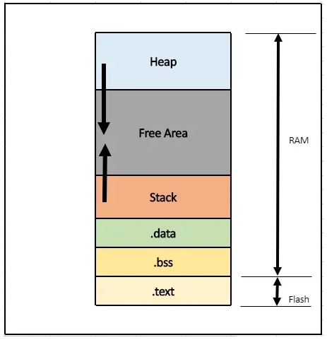

# Embedded C Notes
- Fized-point arithmetic
- Basic I/O Hardware addressing.
- Named address spaces.


## main (int x, char *y []):
- y[] -> Contains the addresses of the arguments supplied at the command line.
- x contains a count of the arguments supplied at the command-line.


## Functions:
- If it has no storage-class specifier, extern is used.
- Name cannot have more than 31 characters.
- Names are case sensitive.
- Names cannot start with a number.
- If return type is not specified it default to int.
- Can have any number of return statements (not recommended).
- Can be inkoked by address.
- Funtion name withour "()" retutn the address.
- Pointers to functions are valid.
- Passing function pointers
```
void CallFuncNumTimes(void (* function)(), int num_of_times){
  ...
  function();
}
...
CallFuncNumTimes(func1, 5);
```
```
int SUM (int a, int b){
  retunr (a+b;)
}
...
int (*fp)(int, int);
fp = SUM
fp(1+2)
```
```
int SUM (int a, int b){
  retunr (a+b;)
}
...
int MUL (int a, int b){
  retunr (a*b;)
}
...
int (*fp[])(int, int) = {SUM,MUL};
fp[0](1+2) // 3
fp[1](1+2) //2
```


## Operations:
- Order of precedence:
  - Postfix(including unaries) / Arithmetic / Shift / Relational / Logical /Bitwise / Conditional / Assignment
- Unary operations -> increments / not / sign change / adress & / sizeof
### Ternay:
```
(a > b a : b)
max = a > b ? a > c ? a : c : b > c ? b : c 
```
### Bitwise operations:
#### Or (|):
#### Xor (^):
#### And (&):
- Can be used to check is a bit is on of off.
- C Implementation: ```n & (1 << k)```
#### Bitwise shift (<< / >>):
- Binary operator.
- Cannot be used on negative integers.
- Can be used to multiply by the powe of two.
  - ``` a << b = a * 2^b ```
- Coyy bit 1, 2, 3 to 9, 10, 11
```
output = input << 8 & 0x0E00
output = (input & 0x000E) << 8
```
- An n-bit field of x that begins at position p
  - ``` (x >> ( p + 1 - n)) & ~( ~ 0 << n ) ```
#### 2's complement:
- Representation of negative numbers.
- Easy conversion:
  - Same number from right to left.
  - Afer first "1" encounter, Invert all the rest not including the first "1".
  - Least significant before the first "1" is the same.
  - ``I.E = -7 = 0000 0000 0000 0111b => 1111 1111 1111 1001b = 0xFFF9.``
- C Implementation:
  - ```y=((x^^0xFFFF)++)&&0xFFFF;```
- Use case: Binary substraction (adding one number to the 2' complement to the negative one).
#### 1's complement:
- Representation of negative numbers.
- Old representation.
- Easy conversion:
  - Negate all the bits in a numnber.
- C Implementation:
  - ``~x``
- Problems representing -0.
#### ## operator:
- Token passing / Concatenation
- Concatenate the two arguments.
  - I.E: ``` a##b -> ab```
#### Helper:
```
#define SET_BIT(reg,n)    ( reg |= (1<<(n-1)) )

#define CLEAR_BIT(reg,n)  ( reg &= ~(1<<(n-1)) )

#define TOGGLE_BIT(reg,n) ( reg ^= (1<<(n-1)) )
```


## C Data Type:
- Size is decided by compiler, but OS can still enforce.
- May change due to MCU size (8bits vs 32 bits)
- It's better to ``` #define uint8_t```
| Type               | Bits    | Range                                       | Printf Symbol |
|--------------------|---------|---------------------------------------------|---------------|
| char               | 8       | -127 a 127                                  | %d            |
| unsigned char      | 8       | 0 a 255                                     | %u            |
| signed char        | 8       | -128 a 127                                  | %d            |
| short              | 16      | -32768 a 32767                              | %d            |
| int                | 16      | -32768 a 32767                              | %i or %d      |
| unsigned int       | 16      | 0 a 65535                                   | %ui           |
| signed int 	       | 16      | -32768 a 32767                              | %i            |
| short int          | 16      | -32768 a 32767                              | %d            |
| unsigned short int | 16	     | 0 a 65535                                   | %ui           |
| signed short int   | 16	     | -32768 a 32767                              | %i            |
| long int           | 32	     | -2147483648 a 2147483647                    | %li           |
| signed long int	   | 32	     | -2147483648 a 2147483647                    | %li           |
| unsigned long int	 | 32	     | 0 a 4294967295                              | %li           |
| long	             | 32	     | -2147483648 a 2147483647                    | %ul           |
| unsigned long	     | 32	     | 0 a 4294967295                              | %l            |
| float	             | 32	     | 3.4E-38 a 3.4E+38                           | %f            |
| double	           | 64	     | 1.7E-308 a 1.7E+308                         | %lf           |
| long double        | 64 ó 80 | 1.7E-308 a 1.7E+308 ó 3.4E-4932 a 1.1E+4932 | %Lf           |
### Printf:
- #: Used with o, x or X specifiers the value is preceded with 0, 0x or 0X respectively for values different than zero.
- It recieves a varaible number of arguments.
- Could be use to convert integer to float or float to an integer.
- o: used to print octal numbers.
- x: used to print hexadecimal.
- p: used to print pointer address.
- e: used for Scientific notation.
- Printf is filled in stack from right to left (first last variable, then the second latest varaible, then the address of format string)
- Evaluation order for the printf is not specified.
- Uses dynamic memory alocation.
- Consumes a lot of time.


## Pointers:
- Variable holdeing a memory address to a datatype
- Void pointer are generic type of pointers that point to any datatype.
- Void pointer need to be dereferenced to the correct data type (proper type casting).
- Forward referencing -> Compiler shall reseve the memory space for the pointer, but the data is not ar all defined.
- Wild pointers -> Uninitializrd pointer / points to arbitrary (random) memory location.
- Near Pointer -> used to store the 16-bit addresses. / can only access the first 64 kb of data using near-pointers.
- Far pointer -> typically 32 bit that can access memory outside current segment.
- Dangling Pointer -> when is freed or de-allocated and it's not assigned to NULL. / Still contain an address after work is done.
- NULL pointer points to nowhere.
  - Used to initialize pointer and avoid having A POINTER TO garbage.
```
int a = 5;
void *b = &a;
*((int*)b)
```
- Usefull Pointer Examples: 
```
uint32_t arr[] = { 14, 22, 33, 44, 55};

arr / &arr  -> Address of the pointer.
arr+1 ->  Adress of pointer + 4 (uint32_t)
&arr+1 -> Adress of pointer + 20 (4 * 5)[uint32_t * SIZE of array]
```
```
int arr[3][4] = { 
  1, 2, 3, 4,
  4, 3, 2, 1,
  7, 8, 9, 0 };

arr / &arr  -> Address of the pointer.
arr+1 ->  Adress of pointer + 16 (4 * 4)  [size of int * columns on row]
&arr+1 -> Adress of pointer + 48 (4 * 12) [size of int  * SIZE of matrix]
```
```
int a[5];
int *pa;

pa = a -> a is pointer notation to int.
pa = &a[0] -> the direction of the first number of an array.
```
```
*pts++; -> Increments the pointer and not the value which it points.
++*ptr; -> Increments the value to which ptr points.
```
```
void (*p[3])(int,int,int) -> Valid array declaration.
void (*p[3])(int,int,float) -> Valid array declaration.
```
```
const char* p = "Samuel" -> non-constan pointer that points to a const string
char a [] = "Samuel -> Const pointer that points to a non-const string.
Both will have "\0" at the end.
```
### Set variable using addres (pointers)
```
set an integer variable at the absolute address 0x67a9 to the value 0xaa55

int *ptr;
ptr = (int *)0x67a9;
*ptr = 0xaa55;
```


## Debugging:
- Functions are not short enough to meet its real time application:
  - Chance often used variable to registers.
  - Precompiling header functions.
- Infinite Loop debugging:
  - Use watchdog function.
  - retriggerable hardware timer to interrupt the processor.
- filecopy PR1.C PR2.C
  - argc would contain 3
  - argv[0] would contain base address of the string “filecopy”
  - argv[1] would contain base address of the string “PR1.C”
  - argv[2] would contain base address of the string “PR2.C”
- Unresponsiveness after startup
  - Run the firmware out of the embedded system's RAM instead of the ROM
- Debugging methods:
  - JTAG port
  - Backgorind debug mode


## Hardware Related:
### Power Consumption:
- Use power mode to reduce power usage.
- Lowering CPU Clock speed.
- Turn off periferal when not used.
### Clock Speed:
- f (Hz) = 1/ T(s)
  - ``` 1 / (0.018) = 55.5Hz ```
### Duty-Cycle:
- Time High / Total period * 100
  - 20ms / 50ms * 100 = 40%
### Pull-up resistor:
- Use to keep an unused input pin a high value.
### Pull-down resistor:
- Use to keep an unused input pin a low value.
### Signal Processing:
- High-Pass filter: remove low-frequency signals.
- Low-Pass filter: Allow only lower than the cutoff frequency.
- Increasing sample rate and apply filtering to the digitized signal could solve some issues.
- To collect data in parallel and in sync -> User timmers (to coordinate the collection in sync) and DMA
### Embedded Systems Periferals:
- Serial Communication Interfaces (SCI) like RS-232, RS-422, RS-485, etc.
- Synchronous Serial Communication Interface like I2C, SPI, SSC, and ESSI.
- Universal Serial Bus (USB).
- Multi Media Cards (SD Cards, Compact Flash, etc).
- Networks like Ethernet, LonWorks, etc.
- Fieldbuses like CAN-Bus, LIN-Bus, PROFIBUS, etc.
- imers like PLL(s), Capture/Compare and Time Processing Units.
- Discrete IO aka General Purpose Input/Output (GPIO).
- Analog to Digital/Digital to Analog (ADC/DAC).
- Debugging like JTAG, ISP, ICSP, BDM Port, BITP, and DP9 ports.
### Ports:
- To determine if a port is an input or an output:
  - Data Direction register.
  - Data Registers.


## Structures:
- Nested structures are valid.
- Can contain a pointer to the same structure as data member.
- Memory gets allocated when a structure variable is created.
- Must be at least one byte.
- Can use ```#pragma pack(n)``` to control the memory aligment.
  - Re-arrenge members of the struct can save space as well
### Structures and Pointers
```
#define dPS struct s *
typedef struct s * tPS;

dPS p1,p2; //p1 to be a pointer to the structure and p2 to be an actual structure
tPS p3,p4; //p3 & p4 to be pointers.
```
```
int a = 5, b = 7, c;
c = a+++b; // c = a++ + b;

6, b = 7 & c = 12
```


## Endianess:
- The order of bytes inside a word of data stored in computer memory
### Little Endian:
- Store multibyte numbers in memeory with the least significant byte at the lowest byte address of the number.
- The number is saved from right to left.
- Dominant ordering for processor architectures.
### Big Endian:
-  Store multibyte numbers in memeory with the most significant byte at the lowest byte address of the number.
-  Number Saved from left to right.
-  Dominant ordering in networking protocols.


## Macros:
- Can be referenced through their addresses.
### Macro Functions
- Expanded by pre-processor.
- Expression evaluated more than onece.
- Don't follow strict datatyping.
- Harder to debug.
- Text replacement everytime.
- ``` #define AREA(l, b) (l * b)```
- ``` #define MAX(a, b, c) (a > b ? a > c ? a : c : b > c ? b : c ) ```
### Inline Functions
- Put the whole function body in the invocation call.
- Can increase code size.
- Reduce context overhead and context switching.
- Expanded by compiler.
- Expression are evaluated once.
- Strict datatype checking.
- Easier to debug.
- Compile replacement, when call happens
- If is not static, then the compiler must assume that there may be calls from other source files.
- ``` inline double square(double x) { return x*x; } ```


## Registers:
- Commonly use volatile
- Can be referenced through their addresses
- Types:
  - Accumulator -> used for all arithmetic and logic operations.
  - R register -> eight auxiliary or helper registers, namely, R0, R1 to R7 -> auxiliary or temporary storage registers in many operations
  - B register -> multiply or divide Accumulator by another number / other R register
  - Data Pointer (DPTR) -> meant for pointing to data
  - Program Counter (PC) -> 2-byte address which tells where the next instruction to execute can be found in the memory
  - Stack Pointer (SP) ->  tells the location from where the next value is to be removed from the stack.
- Accessing by pointer:
```
unsigned *char dev_reg = (unsigned char *)0x80000000;
...
while ((*dev_reg & 1) == 0)
```
### Bit Fields
- Is compiler dependent.
- Will allocate at least one of the largest declared datatype and try to fit everythong there.
  - If not posible will allocate a new space of the largests and continue.
```
struct uart
{
  unsigned baud : 3;
  unsigned parity : 2;
  unsigned unused : 2;
  unsigned interrupt_enable : 1;
};

```


## Loops:
- ```for (a = 0,b = 0;a < 10,b < 5;a++,b++)``` "," is like an logical or.
- ```for(;;) / while(1)``` infite loop


## Keywords:
### Static:
- Maintain value between future function invocations. (inside of a function block).
- Local scope within a module, both variables and functions. (on a file).
### Const:
- Read-only.
- Avoid modification, enforced by compiler.
- A parameter be both const and volatile (I.E: Read only status registers).
### Volatile:
- Tell compiler do not optimize it.
- Tell the compiler to load the variable every time.
- Variable could change anywhere.
- I.E: registers / interrupt services variables / variable shared over multi-threaded.
- A parameter be both const and volatile (I.E: Read only status registers).
- Pointers can be volatile (ISR modifies a pointer to a buffer).
- Has no return value.
- Disabling Interrupt increase the interrupt latency.
### __interrupt:
- ISR
- Should be short and sweet
- Consider re-entrancy and performance of the ISR operation.
- Interrupt latencY -> Time between Interrupt request and the start of the Interrupt routine.
- Can be a nested interrupt -> the highest priority interrupt will be only one not interrupted.
### extern:
- To use variable defined in one file into a different file.
### register:
- Storing a variable in a processor register for faster access.
- Its a sugestion to the compiler, it's not guaranteed
- Stored directly in ALU (Arithmetic Logic Unit)
- ``` register int i = 10;```
- Cannot be acessed by "&"
- Can be used with pointer variable ```register int* a = &i;```
- Cannot be used with static
- Cannot be used on global scope


## Embedded C Errors:
- Syntax errors.
- Linker errors.
- Run-time errors.
- Logical errors.
- Semantic errors.
### Segmentation Fault:
- When you try to access a restricted memory location.
- Use a de-referenced pointer (pointer with invalid address location).
- Access Read-Only memory region.
- Access already freed pointer.
  - Core dump: is a file that is usually written when the application crashes.
### Stack Overflow:
- Use more memory than the memory allocated to the stack.


## Compiler Pre-procesor:
### Include:
- contents of the specified file to be inserted into the original file.
- <> standard library header.
- "" user define header.
### Error:
- Cause pre-proessing to stop.
- Message given is the output of the error.
### Pragma:
- Providing additional information to the compiler
- Examples:
```
#pragma once // current header file to be included only once in a single compilation.
#pragma GCC dependency "/usr/include/time.h" rerun fixincludes // check the relative dates of the current file and another file.
#pragma GCC poison printf sprintf fprintf //  If any of those identifiers appears anywhere in the source after the directive, it is a hard error.
#pragma GCC warning "message" // issue a warning diagnostic with the text ‘message’
#pragma GCC error  "message" // issues an error message
```


## Integer Promotions:
- Byte and short values − They are promoted to int.
- If one operand is a long − The entire expression is promoted to long.
- If one operand is a float − The entire expression is promoted to float.
- If any of the operands is double − The result is promoted to double.
- Expressions involving signed and unsigned types have all operands promoted to unsigned types


## Memory:
### Dynamic Memory Allocation:
- Problems with memory fragmentation, problems with garbage collection, variable execution time.
- malloc(0) is implementation defined, so that the correct answer is ‘it depends’.
- Memory Leaks.
- Lack of Determinism and Predictability.
- Limited Heap Size.
- Fragmented Code Space.
- Memory Management Overhead.
- No Memory Safety Guarantees.
- malloc() -> allocate single block of memory. / Reserves the requested memory.
- calloc() -> n blocks of memory. / Initializes all the bytes with a zero.
- realloc() -> reallocate the already allocated memory while keeping the already initialized .values intact.
- free() -> free memory ```free(p)```
### Stack:
- Part of RAM
- Hold both return addresses and local variables used inside the functions.
- Underestimating stack usage can lead to serious runtime errors which can be difficult to find.
- Worst case maximum stack depth is very useful information.
- Overestimating stack usage means a waste of memory resources.
- When function returns, the used stack memory will be free for use by subsequent function calls.
- Grows downwards in memory
### Heap:
- Part of RAM
- Overflows gracefully
- Dynamic memory of the system is located
- The real-time performance of the heap is not deterministic.
- Data that must live after the function returns.
- Don’t know exactly how much data we will need to store during the execution of the program
### ROM:
- Earlier, ROM were used for program storage and execution. 
- The data stored at each memory location can be read at will but never written.
#### Masked ROM:
- Had to be specified before chip production
#### PROM:
- Programmable ROM
- After programmed its contents can never be changed.
- One-time programmable (OTP) devices
#### EPROM:
- EPROMs can be erased and reprogrammed repeatedly
- Use ultraviolet light.
- Essentially reset the entire chip to its initial-unprogrammed-state
### Hybrid:
- It is possible to overwrite the data in a ROM-like device
#### Flash:
- Non-volatile memory that is electrically reprogrammable and offers fast read access
- Low cost, and fast read access. 
- Can only be erased one sector at a time
- Programs (instructions) are stored in microcontroller’s flash memory (code flash/ program flash) and directly executes in place.
- Store and execute the programs 
#### EEPROM:
- Non-volatile memory that can be electrically erased and programmed.
- Electric erasure and byte-level reprogramming.
- Higher cost and longer write cycles compared to RAM
- Can be more expensive than other memory types and may have a limited number of write cycles.
- Storing configuration data that must survive power cycles but change infrequently.
#### NVRAM:
- modified version of SRAM
- Non-volatile
- Suitable for storing critical data that must be preserved during power loss
### RAM:
- RAM is a volatile memory and contains nothing upon reset or power cycle.
- RAM to store the variables and data.
- During Reflash (Bootloader functionality) some isntruction will be executed on RAM.
- RAM execution is significantly faster than flash.
#### SRAM:
- Volatile memory
- Stores data using flip-flop circuits, ensuring that the data remains intact as long as power is supplied.
- Fast access time
- Higher production cost
- Microcontrollers, digital signal processors, and high-speed data buffers.
#### DRAM:
- Volatile memory
- DRAM stores data in capacitors, which require periodic refreshing to maintain their charge.
- DRAM Controllers can be used.
- Lower cost-per-byte
- Slower access time compared to SRAM
- Multimedia devices, communication systems, and data storage.
### Memory Layout
1. Bootloader/Reset Vector -> Initializes the hardware and loads the main application.
2. Vector Table -> Contains addresses of interrupt service.
3. Text/Code Section -> Holds the executable instructions of the application.
4. Data Section.
   1. Read Only Data -> Constant and Static -> Located at flash.
   2. Initialized Data -> Global and static variables initializaed -> Loaded in RAM.
   3. BSS (Block Started by Symbol) -> Uninitializaed global and static variables. -> located in RAM.
5. Heap -> dynamically allocated portion of RAM.
6. Stack -> function call mechanics portion of the RAM.




## Linker File
- Defining the memory layout.
- Control alignment, padding, and symbol placement.
- Text file in embedded systems that guides the linker during the compilation process.
- uses .ld extention
- Static linking -> linker copying all the library routines used in the program into the executable image. / May require more disk space and memory. / more protable and faster than dynamic linking.
- Dynamic Linking - > placing the name of a sharable library in the excecutable image / Actual linking is done at runtime / multiple program can share a single copy of the library.
### Components:
1. Memory: efines the available memory regions / start addresses, sizes, and access permissions.
2. Sections: placement of different sections within the memory regions defined in the MEMORY block. (text or data or bss)
3. Entry: entry point for the program execution / address of the reset handler or the main function.
4. Symbols: optional component allows you to define custom symbols in your linker file.
### Advance Features:
- NOLOAD: particular section should not be loaded into memory during the program’s startup.
- AT: define the load address of a section.
- ALIAS: create an alias for an existing symbol.
- ASSERT: generate an error during the linking process if a specified condition is not met. 


## Helpfull Examples:
### Passing and casting Structures
```
typedef struct
{
    int a;
    int b;
} new_type;

void f1(void *in);

main()
{
    new_type mine = {0,1};
    printf("%d %d\n",mine.a,mine.b);
    f1(&mine); //pass as reference
    printf("%d %d\n",mine.a,mine.b);
    return 0;
}

void f1(void *in)
{
    new_type *blah = (new_type*)in; // Cast void pointer to pointer to struct
    printf("-%d %d-\n",blah->a,blah->b);
    blah->a = 1;
}
```
### Declarations
```
int a; // An integer
int *a; // A pointer to an integer
int **a; // A pointer to a pointer to an integer
int a[10]; // An array of 10 integers
int *a[10]; // An array of 10 pointers to integers
int (*a)[10]; // A pointer to an array of 10 integers
int (*a)(int); // A pointer to a function a that takes an integer argument and returns an integer
int (*a[10])(int); // An array of 10 pointers to functions that take an integer argument and return an integer
const int a; // Const int
int const a; // Const int
const int *a; // Pointer to const int
int * const a; // Const pointer to integer
int const * a const; //const pointer to a const integer
```
### Byte Swap
```
32bits
return  ((num>>24)&0xff) | ((num<<8)&0xff0000) | ((num>>8)&0xff00) | ((num<<24)&0xff000000);

16bits
return (num>>8) | (num<<8);
```
### Swaping without extra variable
```
void swap(int *a, int *b){
  *a = *a + *b;
  *b = *a - *b;
  *a = *a - *b;
}
```
```
a = 10 , b = 15
void swap(int a, int b){
  a ^= b; //5
  b ^= a; //10
  a ^= b; //15
}
```